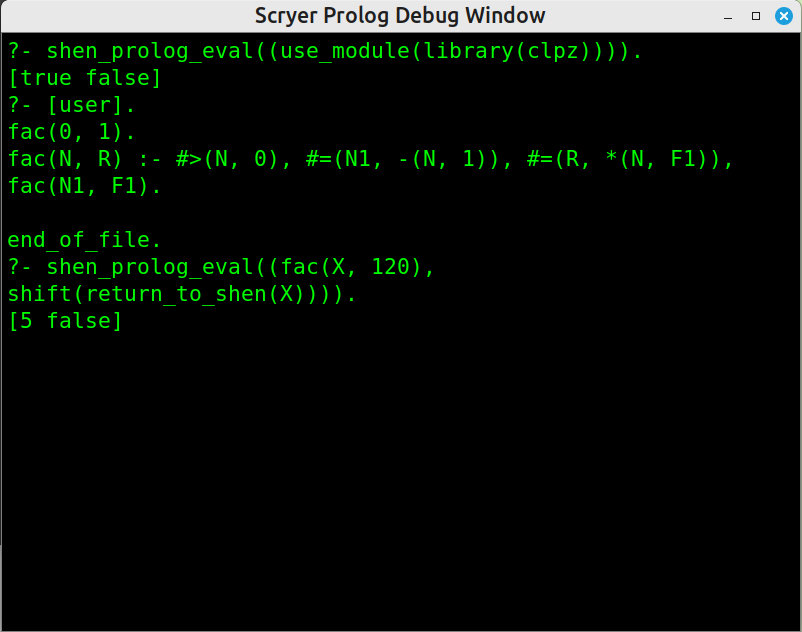

# Scryer Shen

An experimental, in-progress implementation of the [Shen programming
language](https://www.shenlanguage.org) in Racket and [Scryer Prolog](https://github.com/mthom/scryer-prolog).

Unlike most other implementations of Shen, scryer-shen implements Shen
directly in its host languages without bootstrapping from a seed
implementation of KLambda. 

The intention is to allow direct integration of Scryer Prolog inside a
Shen implementation. Scryer Prolog is a performant ISO Prolog system
with powerful metaprogramming capabilities and highly general and
expressive constraint logic programming libraries over integers and
booleans among many other features.

The integration should naturally extend Shen's logic and type systems
to allow styles of dependently typed programming and theorem proving akin to
those found in programming languages like Agda and Lean.

# Progress to a fully featured Shen implementation

- [x] Add `define`, `defun`
- [x] Add `defmacro` and `package`
- [x] Add `defprolog` and `prolog?`
- [x] Add `if` and `cond` forms
- [x] Add `@v`, `@p` and `@s` constructors/patterns
- [x] Add `freeze` and `thaw`
- [x] Add `deftype` and support for type signatures in functions
- [ ] Use `raco` and Racket's `compiler` API to automatically download, 
      compile and package Scryer Prolog with Scryer Shen
- [ ] Implement the rest of the Shen standard library
- [ ] Implement Shen-YACC

# Installation

scryer-shen can be run in the Racket REPL (for
`#lang shen` modules) or compiled to an executable using

```shell
# Install [GNU Make](https://www.gnu.org/software/make/#download)
# Install [racket](https://download.racket-lang.org/)
# before 
# - logging into a shell terminal, and
# - executing the following commands
# from cloned `scryer-shen` project root directory
# before passing `ensure-scryer-shen-executable-availability` target to make binary
# so that making `shen` executable is made available
make ensure-scryer-shen-executable-availability
```

The scryer-prolog executable must be copied to
the install directory `dist/bin`. It can be downloaded from the above
link and built by following the instructions there. Soon this requirement
will be automated through raco.

# Non-standard extensions of Shen Prolog

Scryer Shen has full access to Scryer Prolog's library modules. They
are loaded in `prolog?` forms using the non-standard syntax

```
(1-) (prolog? (use-module (library clpz)))
```

Also unlike standard Shen Prolog, Scryer Shen Prolog supports 
functor notation for the sake of partial evaluation in libraries
like [`clpz`](https://github.com/triska/clpz):

```
(2-) (defprolog fac
0 1 <--;
N R <-- (#> N 0)
        (#= N1 -(N 1))
        (#= R *(N F1))
        (fac N1 F1);)
(3-) (prolog? (fac X 120) (return X))
5
```

`-(N 1)` and `*(N F1)` annotate the ISO Prolog functors `-(N,1)`
and `*(N,F1)` while s-expressions annotate either Shen function calls
or Prolog predicate calls as in standard Shen Prolog.

Scryer Shen Prolog predicates and queries are converted to ISO Prolog
syntax and streamed to the Scryer Prolog subprocess. The interaction
between Scryer Shen and Scryer Prolog is displayed in the Scryer
Prolog Debug Window, which for the above interaction is



# An example interaction

The loaded files are found in [examples](https://github.com/mthom/scryer-shen/tree/master/examples).

```shen
(0-) (tc +)
true

(1+) (load "examples/days.shen")
days#type
next-day : (day --> day)
loaded : symbol

(2+) (load "examples/apply.shen")
h-list-to-function-sig
heterogeneous-lists#type
true
heterogeneously-mappable-functions#type
apply : ((h-mappable [A | B] C) --> ((h-list [A | B]) --> C))
loaded : symbol

(3+) (apply + [1 2 3])
type error

(4+) (apply + [1 2])
3 : number

(5+) [1 saturday]
[1 saturday] : (h-list [number symbol])

(6+) (apply + [1])
curried:+ : (number --> number)

(7+) (apply +)
curried:apply : ((h-list [number]) --> (number --> number))

(8+) (fn apply)
apply : ((h-mappable [A | B] C) --> ((h-list [A | B]) --> C))
```
